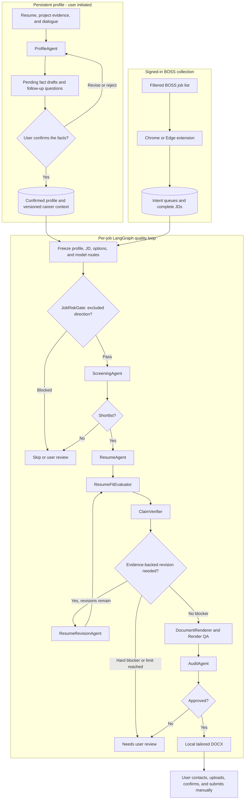

# CareerFlow Local

[](https://github.com/MissingDanial/careerflow-local/actions/workflows/ci.yml)

**English** | [简体中文](README.zh-CN.md)

CareerFlow Local is a local-first BOSS Zhipin job application workbench. It collects complete job descriptions from the user's signed-in browser, organizes jobs into intent queues, maintains a reusable candidate profile, and runs an evidence-gated Agent workflow that produces tailored DOCX resumes.

> Current boundary: the project prepares and audits applications locally. Greeting, resume upload, confirmation, and final submission remain user actions.

## What Works Today

| Area | Current capability |
| --- | --- |
| Job collection | Capture rendered BOSS job cards, open visible details sequentially, complete missing JDs, and sync them to SQLite |
| Intent queues | Keep Product, Algorithm, or other queues separate while globally deduplicating jobs and application history |
| Candidate profile | Import DOCX/PDF/TXT/Markdown resumes, hold ProfileAgent conversations, and persist only user-confirmed facts |
| Agent workflow | Apply a risk gate, score fit, generate a tailored resume, verify JD coverage and claims, revise when evidence allows, and audit the result |
| Resume output | Generate a two-page-oriented DOCX with template controls, render QA, source mappings, and version history |
| Application tracking | Open the selected BOSS page and record manual contact/application progress without claiming an unverified platform action |

The project does not bypass login, CAPTCHA, security checks, rate limits, or platform permissions. Collection pauses when BOSS requires user verification. The default UI does not perform real resume upload or final submission; a historical single-job greeting canary remains disabled and is not part of the normal workflow.

## 10-Minute Quick Start

### 1. Install prerequisites

- Node.js **24 or newer** (`node:sqlite` is required)
- npm
- Chrome or Edge with Developer mode enabled
- A BOSS Zhipin account that the user signs into manually
- Windows for the packaged Native Messaging launcher; other systems can start the backend manually

### 2. Clone and install

```powershell
git clone https://github.com/MissingDanial/careerflow-local.git
cd careerflow-local
npm ci
node --version
```

### 3. Load the browser extension

1. Open `chrome://extensions/` or `edge://extensions/`.
2. Enable **Developer mode**.
3. Select **Load unpacked**.
4. Choose this repository's `extension` directory.
5. Keep the extension page open until the optional Native Host is installed.

The extension UI is currently in Simplified Chinese.

### 4. Start the local backend

Windows users can install the one-click launcher after loading the extension:

```powershell
npm run native:install
```

Reload the extension after installation. The popup button `启动后端` starts the allowlisted local backend.

If extension-ID discovery fails, copy the 32-character ID from the extensions page and run:

```powershell
powershell -NoProfile -ExecutionPolicy Bypass -File scripts/install-native-host.ps1 -ExtensionId <extension-id> -Browser Chrome
```

Manual startup works on every supported system:

```powershell
npm run server
```

Keep that terminal open and verify the service:

```powershell
Invoke-RestMethod http://127.0.0.1:8787/health
```

Expected response:

```json
{"ok":true,"service":"boss-find-backend"}
```

### 5. Configure a model

Collection and rule-only checks can run without a model. ProfileAgent dialogue and the default tailored-resume path require an OpenAI-compatible endpoint.

Open the extension gear icon, then go to `设置` -> `基础模型服务`. Enter the Base URL, model, Responses or Chat Completions protocol, and API key. Save the configuration and run the connection test.

Credentials are backend-owned and stored only in the ignored local file:

```text
server/data/model-provider.local.json
```

For the recommended M18 routing defaults, create the ignored local overlay:

```powershell
Copy-Item boss-model.example.json boss-model.local.json
```

Change the example model names if the configured provider exposes different models.

## First Complete Workflow

1. Open `个人经历` in the workbench, upload a resume, and confirm the extracted facts. Use ProfileAgent dialogue to add or correct career evidence.
2. Sign in to BOSS manually, open a filtered job list, select an intent queue in the extension popup, and click `开始岗位信息采集`.
3. Keep the BOSS tab visible while the extension opens rendered jobs and completes their JDs. Use `暂停` or `重试` when the page requires attention.
4. Open `Boss Find 工作台` and process the selected queue through its four stages: complete JD, screening, tailored resume, and manual contact/application.
5. Review the final Agent checks and DOCX before opening the BOSS job page for manual execution.

Generated resumes are written to `server/data/generated_resumes/` unless another output directory is selected.

## Agent Workflow

ProfileAgent is a persistent upstream profile builder. It runs only when the user imports evidence or edits the profile; it is not reset or called again for every job. Each job workflow freezes the confirmed profile, JD, options, and model configuration before entering LangGraph.



### Responsibility and control

| Component | Responsibility | Hard boundary |
| --- | --- | --- |
| ProfileAgent | Turn uploaded evidence and dialogue into a reusable career profile | New facts remain pending until user confirmation |
| JobRiskGate | Reject excluded directions before spending matching calls | A model cannot override a deterministic block |
| ScreeningAgent | Score job/profile fit and recommend shortlist, review, or skip | Cannot trigger a BOSS action |
| ResumeAgent | Select confirmed evidence and write a JD-tailored resume | Cannot invent experience, metrics, or skills |
| ResumeFitEvaluator | Check visible resume evidence against JD requirements | Covered/weak results require exact resume evidence |
| ClaimVerifier | Map every claim to confirmed sources | Unsupported claims block approval |
| ResumeRevisionAgent | Create a new version when confirmed evidence can repair a problem | Bounded retries; old versions are never overwritten |
| DocumentRenderer | Generate DOCX and run render/page/section QA | Render failures remain blockers |
| AuditAgent | Combine fit, claim, render, and policy evidence into the final decision | Model output cannot weaken deterministic gates |

The recommended M18 route uses a model only for ResumeAgent and ResumeRevisionAgent. Screening, Fit, Claim, and Audit remain deterministic by default. Per-Agent routes and `rules`, `llm`, `hybrid`, or `auto` modes can be changed in local settings.

## Architecture and Local Data

```text
Signed-in BOSS page
  -> Chrome/Edge MV3 extension
  -> Node.js backend on 127.0.0.1:8787
  -> SQLite, local profile, workflow traces, and DOCX files
```

| Path | Purpose |
| --- | --- |
| `extension/` | Collection popup, queue workbench, profile, settings, and diagnostics UI |
| `server/src/server.js` | Local HTTP API |
| `server/src/resume-workflow-graph.js` | LangGraph orchestration, bounded revision, telemetry, and cache integration |
| `server/src/sqlite-store.js` | SQLite persistence and workflow records |
| `native-host/` | Allowlisted local backend launcher |
| `.agents/skills/career-retrospective-to-job/` | Profile interview, fact-boundary, and persistent career-context rules |
| `.agents/skills/resume-to-word/` | Evidence-bound two-page DOCX resume rules |
| `docs/` | Product, architecture, Agent, milestone, and BOSS platform decisions |

All runtime data lives under ignored local paths:

| Local path | Contents |
| --- | --- |
| `server/data/boss_find.sqlite3` | Jobs, queues, profiles, Agent runs, and workflow events |
| `server/data/model-provider.local.json` | Model credentials and provider settings |
| `server/data/career_context/` | Versioned career context |
| `server/data/generated_resumes/` | Generated DOCX files |
| `server/data/execution_packages/` | Manual execution packages |
| `server/data/logs/` | Native backend logs |

API keys are not stored in extension settings, API responses, logs, or Git. When a model is enabled, the relevant JD and confirmed profile content is sent to the provider selected by the user.

## Quality Evidence

- Formal M16 evaluation: **27** complete samples, **75/75** model nodes successful, and **11/11** quality gates passed.
- Claim support rate: **96.68%**; unsupported claims: **0**.
- Current repository checks: **131** JavaScript files and **73** smoke scripts in CI.
- M18 local benchmark on one fixed profile/JD: GPT-5.5 resume-only routing completed in **44.3 s** with one model call; repeated semantic inputs can return from workflow cache with zero model calls.

These are engineering quality and latency measurements, not evidence of improved interview or application conversion.

## Troubleshooting

| Symptom | Check first |
| --- | --- |
| Native Host unavailable | Load the extension before `npm run native:install`, pass the extension ID explicitly if needed, then reload the extension |
| Backend does not start | Confirm Node 24+, run `npm run server`, check port `8787`, then open `http://127.0.0.1:8787/health` |
| Model test fails | Verify Base URL, protocol, model name, timeout, and provider compatibility; inspect sanitized workflow errors |
| Collection pauses | Complete login/CAPTCHA/security verification manually, keep the list visible, load more cards, then click Retry |
| A refreshed job is skipped | Complete jobs are skipped by extension cache and backend identifiers; SQLite upsert is the final deduplication layer |

Do not attempt to bypass BOSS security controls when diagnosing collection failures.

## Development

```powershell
npm ci
npm run check
npm run test:agents
npm run test:extension
npm run test:workflow
npm run test:ci
```

Use a separate data directory for manual development:

```powershell
$env:BOSS_DATA_DIR = Join-Path $PWD '.local-dev-data'
$env:PORT = '8788'
npm run server
```

Before publishing a fork, run `git status --short --ignored` and `npm run m13:repository-baseline:smoke` to verify that credentials, databases, generated resumes, logs, and evaluation outputs remain untracked.

## Detailed Documentation

- [Product requirements](docs/01_PRD.md)
- [Technical architecture](docs/02_TECH_ARCHITECTURE.md)
- [Agent workflow and error handling](docs/03_AGENT_WORKFLOW.md)
- [Development plan and milestone history](docs/04_DEVELOPMENT_PLAN.md)
- [Open-source reuse decisions](docs/05_OPEN_SOURCE_REUSE.md)
- [BOSS platform constraints](docs/06_BOSS_PLATFORM_LOGIC.md)
- [Browser executor POC](docs/07_BROWSER_EXECUTOR_POC.md)
- [Firecrawl decision](docs/08_FIRECRAWL_DECISION.md)

## License

[MIT](LICENSE)
