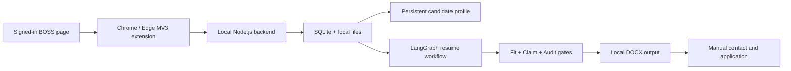

# CareerFlow Local

[](https://github.com/MissingDanial/careerflow-local/actions/workflows/ci.yml)

**English** | [简体中文](README.zh-CN.md)

CareerFlow Local is a local-first job application workbench for BOSS Zhipin. It combines a Chrome/Edge MV3 extension, a Node.js backend, SQLite persistence, a persistent candidate profile, and an evidence-gated LangGraph resume workflow.

The current product path is:

```text
Collect complete JDs from the signed-in BOSS page
-> organize jobs into intent queues
-> reject unwanted directions with a risk gate
-> score job/profile fit
-> generate a tailored DOCX resume
-> verify every resume claim and render result
-> let the user contact and apply manually
```

The extension UI is currently in Simplified Chinese. This README includes the Chinese labels used in the UI so an English reader can still complete the setup and first workflow.

## Project Status

The repository is a working local prototype, not a hosted service.

Available today:

- Capture currently rendered job cards from a signed-in BOSS job list.
- Open visible job details sequentially to complete missing descriptions and sync them to SQLite.
- Maintain separate job-intent queues, such as Product and Algorithm, while globally deduplicating jobs.
- Upload a resume and maintain a reusable, versioned career profile through ProfileAgent conversations and confirmed fact drafts.
- Run ScreeningAgent, ResumeAgent, ResumeFitEvaluator, ClaimVerifier, ResumeRevisionAgent, and AuditAgent through one traceable LangGraph workflow.
- Generate a two-page-oriented DOCX resume, run render QA, and keep claim-to-source mappings.
- Cache a completed semantic workflow and route only resume generation/revision to a model while deterministic quality gates remain local.
- Record manual greeting/application progress without claiming that BOSS actions succeeded automatically.

Deliberate boundaries:

- The project does not bypass login, CAPTCHA, security checks, or platform rate limits.
- Real resume upload and application submission remain disabled.
- A single-job real greeting canary exists for internal testing but is disabled by default and is not part of the normal user path.
- Collection depends on the DOM that BOSS has rendered for the signed-in user. Selector changes or security pages can pause the workflow.
- API keys and local career data are not committed, but JD/profile content used by a model is sent to the model provider configured by the user.

## Architecture



Main runtime components:

| Path | Responsibility |
| --- | --- |
| `extension/` | BOSS page capture, queue controls, workbench, profile and settings UI |
| `server/src/server.js` | Local HTTP API on `127.0.0.1:8787` |
| `server/src/sqlite-store.js` | SQLite persistence and workflow records |
| `server/src/resume-workflow-graph.js` | LangGraph orchestration, caching and bounded revision |
| `native-host/` | Allowlisted local backend launcher for the browser extension |
| `.agents/skills/career-retrospective-to-job/` | Profile interview and persistent career-context rules |
| `.agents/skills/resume-to-word/` | Evidence-bound two-page DOCX resume rules |
| `docs/` | Product, architecture, workflow and BOSS platform decisions |

## Requirements

- Node.js **24 or newer**. The backend uses the built-in `node:sqlite` API.
- npm, included with Node.js.
- Chrome or Edge with Developer mode enabled.
- A BOSS Zhipin account that the user signs into manually.
- Windows for the packaged Native Messaging launcher.
- macOS/Linux can run the backend manually with `npm run server`; the provided Native Host installer is Windows-specific.
- An OpenAI-compatible model endpoint is optional for collection and rule-only checks, but required for ProfileAgent dialogue and the default model-backed resume generation path.

## 10-Minute Quick Start

### 1. Clone and install

```powershell
git clone https://github.com/MissingDanial/careerflow-local.git
cd careerflow-local
npm ci
node --version
```

The Node version must report `v24` or newer.

### 2. Load the unpacked extension

Chrome:

1. Open `chrome://extensions/`.
2. Enable **Developer mode**.
3. Choose **Load unpacked**.
4. Select this repository's `extension` directory.
5. Keep the page open until the Native Host is installed.

Edge uses the same flow at `edge://extensions/`.

### 3. Start the local backend

#### Windows: install the one-click launcher

Load the unpacked extension first, then run:

```powershell
npm run native:install
```

The installer builds the fixed Native Host, discovers the unpacked extension ID, registers it for the current Windows user, and creates a local backend token. Reload the extension after installation. The popup button `启动后端` means **Start backend**.

If automatic extension-ID discovery fails, copy the 32-character ID from the extensions page and run:

```powershell
powershell -NoProfile -ExecutionPolicy Bypass -File scripts/install-native-host.ps1 -ExtensionId <extension-id> -Browser Chrome
```

#### Any supported OS: run the backend manually

```powershell
npm run server
```

Keep that terminal open. Verify the backend in another terminal:

```powershell
Invoke-RestMethod http://127.0.0.1:8787/health
```

Expected response:

```json
{"ok":true,"service":"boss-find-backend"}
```

### 4. Configure a model

Open the extension, click the gear icon, then open `设置` (**Settings**) -> `基础模型服务` (**Base model provider**).

Enter:

- Base URL, for example `https://api.openai.com/v1`
- Model name
- Wire API: Responses or Chat Completions
- API key
- Optional reasoning effort, timeout and retry values

Choose `保存配置` (**Save**) and then `测试连接` (**Test connection**).

The API key is written only to the ignored local file `server/data/model-provider.local.json`. It is not stored in extension settings, API responses, logs, or Git.

To use the tested M18 speed routing defaults, create the ignored local overlay before configuring the provider:

```powershell
Copy-Item boss-model.example.json boss-model.local.json
```

On macOS/Linux, use `cp boss-model.example.json boss-model.local.json`.

This route uses a model for ResumeAgent and ResumeRevisionAgent, while Screening, Fit, Claim, and Audit remain deterministic. Update the model names in the local overlay if your provider does not expose the example models.

### 5. Run the first workflow

1. Open `个人经历` (**Profile**) in the workbench.
2. Upload a DOCX, PDF, TXT, or Markdown resume.
3. Review and confirm extracted facts. Use ProfileAgent dialogue when a model is configured.
4. Open and sign in to `https://www.zhipin.com/`, then navigate to a filtered job list.
5. In the popup, select the target intent queue and click `开始岗位信息采集` (**Start collection**).
6. Leave the BOSS list tab visible while job details are completed. Use `暂停` (**Pause**) or `重试` (**Retry**) when needed.
7. Open `Boss Find 工作台` (**Boss Find workbench**).
8. Process the four stages: complete JDs, screening, tailored resumes, and manual contact/application.

The generated resumes are stored under `server/data/generated_resumes/` unless another output directory is selected in the workbench.

## Everyday Workflow

### Candidate profile

ProfileAgent is an upstream profile builder, not a per-job node. Confirmed profile facts and the generated `career_agent_context.md` persist across job workflows. Reopen ProfileAgent only when the user's history changes or the context becomes stale.

Default local context path:

```text
server/data/career_context/career_agent_context.md
```

### Job collection and queues

- Jobs are globally deduplicated by stable BOSS identifiers and detail URLs.
- Queue membership is separate, so one job can appear in multiple intent queues without duplicating the application history.
- Removing a job from a queue is a soft removal; recapturing the same page does not silently restore it.
- The extension automatically skips jobs whose complete JD already exists locally.

### Risk gate and screening

Users can enable excluded directions such as sales or livestreaming. A blocked direction is rejected before model scoring. Jobs can be explicitly trusted and re-screened from the selected queue when a false positive is confirmed.

### Tailored resume workflow

```text
ScreeningAgent
-> ResumeAgent
-> ResumeFitEvaluator
-> ClaimVerifier
-> ResumeRevisionAgent (only when evidence-bound work is possible)
-> Render QA
-> AuditAgent
```

The default template hides standalone summary and skill sections. A required skill can be surfaced inside a project only when both a confirmed profile skill and a related project fact support it. Hidden fields do not count toward fit, and a rejected revision cannot bypass a blocker.

### Manual application

The workbench opens the selected BOSS job page and records manual progress. The user remains responsible for greeting, resume upload, confirmation, and submission. This is intentional: the project does not claim a successful platform action without readback evidence.

## Local Data and Privacy

The default data directory is `server/data/`, which is ignored by Git except for `.gitkeep`.

| Local path | Contents |
| --- | --- |
| `server/data/boss_find.sqlite3` | Jobs, queues, profile facts, Agent runs and workflow events |
| `server/data/model-provider.local.json` | Backend-owned provider credentials and settings |
| `server/data/career_context/` | Versioned career context |
| `server/data/generated_resumes/` | Generated DOCX resumes |
| `server/data/execution_packages/` | Manual execution-package archives |
| `server/data/logs/` | Native backend logs |

Also ignored: `.env`, `gpt5.5.txt`, `boss-model.local.json`, databases, DOCX/PDF files, logs, and local evaluation output.

Before publishing a fork, run:

```powershell
git status --short --ignored
npm run m13:repository-baseline:smoke
```

## Model Quality and Latency

The formal M16 quality evaluation used 27 complete samples. All 75 model-backed nodes succeeded and all 11 quality gates passed. Claim support was 96.68%, unsupported claims were zero, and the run recorded model latency/token telemetry. These engineering metrics do not prove real application conversion.

The M18 local comparison used the same confirmed profile and JD:

| Route | Total time | Model calls | Revisions | Fit | Claims | Audit |
| --- | ---: | ---: | ---: | --- | --- | --- |
| GPT-5.5 Responses for Resume only; deterministic gates | 44.3 s | 1 | 0 | 67, no blocker | 54/54 supported | approve |
| GPT-5.4-mini Chat for Resume/Revision; deterministic gates | 48.7 s | 2 | 1 | 62, no blocker | 54/54 supported | approve |

The GPT-5.5 resume prompt was reduced from 8,157 to 4,561 input tokens. A repeated deterministic smoke run resolves from the semantic workflow cache with zero model calls. Results depend on the provider, model, JD, profile and local machine.

## Development and Validation

Install dependencies with the lockfile:

```powershell
npm ci
```

Useful checks:

```powershell
npm run check
npm run test:profile
npm run test:agents
npm run test:extension
npm run test:workflow
npm run m18:agent-latency:smoke
npm run test:ci
```

The current CI tier covers 131 JavaScript files and 73 smoke scripts. GitHub Actions runs on Node.js 24 and installs Playwright Chromium for extension UI checks.

Run a development backend with a separate data directory when testing manually:

```powershell
$env:BOSS_DATA_DIR = Join-Path $PWD '.local-dev-data'
$env:PORT = '8788'
npm run server
```

## Troubleshooting

### The popup says the Native Host is unavailable

1. Confirm the unpacked extension was loaded before `npm run native:install`.
2. Rerun the installer with the extension ID explicitly.
3. Reload the extension from `chrome://extensions/` or `edge://extensions/`.
4. Check `server/data/native-host/host-config.json` and `server/data/logs/`.

### The backend does not start

- Run `node --version`; Node 24+ is required.
- Run `npm run server` directly to expose the startup error.
- Check whether another process already uses `127.0.0.1:8787`.
- Verify `http://127.0.0.1:8787/health` before debugging the extension.

### The model connection test fails

- Confirm the Base URL includes the provider's required `/v1` path.
- Confirm the selected wire API is supported by that model.
- Increase timeout for slow reasoning models.
- Keep model names provider-specific; the example overlay is not a guarantee that every provider exposes those names.
- Inspect sanitized Agent telemetry and workflow errors in Advanced diagnostics. Full API keys are intentionally never returned.

### Collection pauses or no more JDs appear

- Resolve login, CAPTCHA, or security checks manually, then click Retry.
- Keep the job list tab active long enough for BOSS lazy loading.
- Scroll the list to load more cards when the visible set is exhausted.
- Review recent collection errors for selector drift.
- Do not try to bypass platform security controls.

### A job is skipped after refresh

This is usually expected. Complete jobs are skipped using local extension cache plus backend keys, and SQLite upsert remains the final deduplication layer.

## Repository Documentation

- [Product requirements](docs/01_PRD.md)
- [Technical architecture](docs/02_TECH_ARCHITECTURE.md)
- [Agent workflow](docs/03_AGENT_WORKFLOW.md)
- [Development plan](docs/04_DEVELOPMENT_PLAN.md)
- [Open-source reuse decisions](docs/05_OPEN_SOURCE_REUSE.md)
- [BOSS platform constraints](docs/06_BOSS_PLATFORM_LOGIC.md)
- [Browser executor POC](docs/07_BROWSER_EXECUTOR_POC.md)
- [Firecrawl decision](docs/08_FIRECRAWL_DECISION.md)

The detailed documents are currently written in Chinese. Start with this README for the runnable path and use the Chinese README for the full milestone history.

## Milestone Map

- **M13.1-M13.5**: repository CI, SQLite migrations, immutable workflow inputs, transition invariants, and deterministic evaluation.
- **M14.1**: default-off real greeting canary with one-time authorization and readback requirements.
- **M15.1**: persistent ProfileAgent conversation memory and confirm-before-write profile updates.
- **M16 / M16.1**: real-model quality evaluation and read-only Shadow review.
- **M17 / M17.1**: intent queues, Native Host startup, model settings, four-stage workbench, and manual application tracking.
- **M18**: semantic workflow cache, per-Agent model routing, prompt compaction, final-only DOCX rendering, and no-op revision removal.

## Contributing

Keep changes local-first and evidence-bound:

- Do not add code that bypasses BOSS authentication, CAPTCHA, or security checks.
- Do not persist raw API keys in extension storage, logs, fixtures, or tracked files.
- Do not let model output weaken deterministic risk, claim, fit, render, or transition gates.
- Add a focused smoke test for behavior changes and run `npm run test:ci` before publishing.
- Preserve SQLite migration ordering and backward compatibility.

## License

[MIT](LICENSE)
