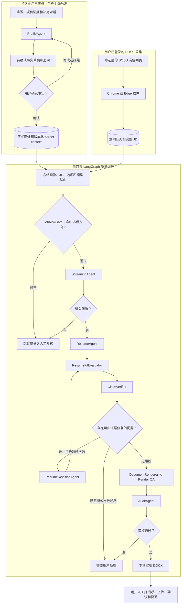

# CareerFlow Local

[](https://github.com/MissingDanial/careerflow-local/actions/workflows/ci.yml)

**简体中文** | [English](README.md)

CareerFlow Local 是一个本地优先的 BOSS 直聘求职工作台。它从用户已登录的浏览器采集完整职位描述，按求职意向管理岗位队列，持久化候选人画像，并通过带证据门禁的 Agent 工作流生成定制 DOCX 简历。

> 当前边界：项目负责在本地准备和审核投递材料；打招呼、上传简历、确认和最终投递仍由用户完成。

## 当前能做什么

| 模块 | 当前能力 |
| --- | --- |
| 岗位采集 | 读取 BOSS 当前已渲染岗位，依次打开可见详情，补齐缺失 JD 并同步到 SQLite |
| 意向队列 | 分别管理产品、算法等岗位方向，同时对岗位和投递历史做全局去重 |
| 用户画像 | 导入 DOCX/PDF/TXT/Markdown 简历，通过 ProfileAgent 多轮对话补充经历，仅持久化用户确认的事实 |
| Agent 闭环 | 风险门禁、岗位评分、定制简历、JD 覆盖检查、Claim 校验、证据内修订和最终审核 |
| 简历输出 | 生成面向两页的 DOCX，执行模板、渲染、页数、章节和事实来源 QA，并保留版本历史 |
| 投递跟踪 | 打开选中的 BOSS 岗位页，记录人工联系和投递进度，不把未验证的平台动作写成成功 |

项目不会绕过登录、验证码、安全校验、频率限制或平台权限。BOSS 要求验证时采集会暂停。默认界面不会执行真实简历上传或最终投递；历史单岗位真实打招呼 canary 默认关闭，也不属于正常使用流程。

## 10 分钟开始使用

### 1. 准备环境

- Node.js **24 或更高版本**，后端依赖 `node:sqlite`
- npm
- 开启开发者模式的 Chrome 或 Edge
- 由用户自行登录的 BOSS 直聘账号
- Windows 可使用 Native Messaging 一键启动器；其它系统可手动启动后端

### 2. 克隆并安装依赖

```powershell
git clone https://github.com/MissingDanial/careerflow-local.git
cd careerflow-local
npm ci
node --version
```

### 3. 加载浏览器插件

1. 打开 `chrome://extensions/` 或 `edge://extensions/`。
2. 开启“开发者模式”。
3. 点击“加载已解压的扩展程序”。
4. 选择仓库中的 `extension` 目录。
5. 安装 Native Host 前先保留扩展管理页，后续可能需要扩展 ID。

### 4. 启动本地后端

Windows 用户建议在加载插件后安装一键启动器：

```powershell
npm run native:install
```

安装完成后重新加载插件。popup 中的“启动后端”按钮只会启动白名单内的本地后端入口。

如果安装器没有识别扩展 ID，从扩展管理页复制 32 位 ID 后执行：

```powershell
powershell -NoProfile -ExecutionPolicy Bypass -File scripts/install-native-host.ps1 -ExtensionId <extension-id> -Browser Chrome
```

所有支持的系统都可以手动启动：

```powershell
npm run server
```

保持终端开启，并检查健康状态：

```powershell
Invoke-RestMethod http://127.0.0.1:8787/health
```

预期结果：

```json
{"ok":true,"service":"boss-find-backend"}
```

### 5. 配置模型

岗位采集和纯规则检查不强制使用模型。ProfileAgent 对话和默认的定制简历生成需要 OpenAI 兼容接口。

点击插件齿轮，进入“设置” -> “基础模型服务”，填写 Base URL、模型、Responses 或 Chat Completions 协议和 API Key，保存后执行连接测试。

凭据只由后端管理，并写入被 Git 忽略的本地文件：

```text
server/data/model-provider.local.json
```

使用推荐的 M18 节点路由时，创建被忽略的本地覆盖配置：

```powershell
Copy-Item boss-model.example.json boss-model.local.json
```

如果模型供应商没有示例中的模型名称，请修改本地配置，不要提交包含凭据的配置文件。

## 第一次完整使用

1. 在工作台打开“个人经历”，上传简历并确认提取出的事实；需要补充或纠正经历时使用 ProfileAgent 对话。
2. 用户自行登录 BOSS，进入筛选后的岗位列表，在插件 popup 中选择意向队列并点击“开始岗位信息采集”。
3. 保持 BOSS 标签页可见，让插件依次打开已渲染岗位并补齐 JD；页面需要人工处理时使用“暂停”或“重试”。
4. 打开“Boss Find 工作台”，按当前队列处理四个阶段：完整 JD、岗位筛选、定制简历、人工联系与投递。
5. 查看 Agent 最终检查和 DOCX，确认无误后再打开 BOSS 岗位页人工执行。

未选择其它目录时，生成的简历位于 `server/data/generated_resumes/`。

## Agent 处理流程

ProfileAgent 是持久化的上游画像入口。它只在用户导入材料或修改个人经历时运行，不会为每个岗位重新初始化或重复询问。单岗位任务进入 LangGraph 前，会先冻结已确认画像、JD、执行选项和模型路由。



### Agent 职责与控制边界

| 组件 | 职责 | 不可越过的边界 |
| --- | --- | --- |
| ProfileAgent | 把用户材料和对话整理为可复用画像 | 新事实必须先进入待确认状态，用户确认后才能成为正式事实 |
| JobRiskGate | 在匹配调用前排除销售、直播等用户不想去的方向 | 模型不能覆盖确定性风险阻断 |
| ScreeningAgent | 评估岗位与画像匹配度，输出候选、复核或跳过建议 | 不能触发 BOSS 操作 |
| ResumeAgent | 选择已确认的经历，生成针对 JD 的简历 | 不得编造经历、指标或技能 |
| ResumeFitEvaluator | 检查可见简历内容对 JD 要求的覆盖 | covered/weak 必须给出简历中的准确证据 |
| ClaimVerifier | 把每条简历 claim 映射到已确认来源 | unsupported claim 会阻断审核 |
| ResumeRevisionAgent | 在现有证据可以修复问题时创建新版本 | 有限次数，不覆盖旧版本，不引入新事实 |
| DocumentRenderer | 生成 DOCX，执行渲染、页数和章节 QA | 渲染硬失败继续作为阻断项 |
| AuditAgent | 汇总 Fit、Claim、渲染和策略证据，给出最终决定 | 模型输出不能削弱确定性门禁 |

推荐的 M18 路由只让 ResumeAgent 和 ResumeRevisionAgent 调用模型；Screening、Fit、Claim 和 Audit 默认走确定性规则。用户可以在本地设置中按 Agent 调整路由，并选择 `rules`、`llm`、`hybrid` 或 `auto` 模式。

## 架构与本地数据

```text
用户已登录的 BOSS 页面
  -> Chrome/Edge MV3 插件
  -> 127.0.0.1:8787 Node.js 后端
  -> SQLite、用户画像、工作流 trace 和 DOCX
```

| 路径 | 作用 |
| --- | --- |
| `extension/` | 采集 popup、岗位队列工作台、个人经历、设置和诊断 UI |
| `server/src/server.js` | 本地 HTTP API |
| `server/src/resume-workflow-graph.js` | LangGraph 编排、有限修订、遥测和缓存接入 |
| `server/src/sqlite-store.js` | SQLite 持久化和工作流记录 |
| `native-host/` | 只允许启动固定后端入口的本地启动器 |
| `.agents/skills/career-retrospective-to-job/` | ProfileAgent 访谈、事实边界和持久化人生经历规则 |
| `.agents/skills/resume-to-word/` | 证据约束下的两页 DOCX 简历规则 |
| `docs/` | 产品、架构、Agent、开发里程碑和 BOSS 平台决策 |

运行数据默认保存在被 Git 忽略的本地路径：

| 本地路径 | 内容 |
| --- | --- |
| `server/data/boss_find.sqlite3` | 岗位、队列、画像、Agent run 和 workflow event |
| `server/data/model-provider.local.json` | 模型凭据和供应商设置 |
| `server/data/career_context/` | 版本化用户画像上下文 |
| `server/data/generated_resumes/` | 生成的 DOCX |
| `server/data/execution_packages/` | 人工执行包 |
| `server/data/logs/` | Native Host 和后端日志 |

API Key 不会写入插件存储、API 响应、日志或 Git。启用模型后，相关 JD 和已确认用户画像会发送给用户选择的模型供应商。

## 质量验证

- M16 正式评测：**27** 个完整样本、**75/75** 个模型节点成功、**11/11** 项质量门槛通过。
- Claim 支撑率：**96.68%**；unsupported claim：**0**。
- 当前仓库 CI：检查 **131** 个 JavaScript 文件，执行 **73** 个烟测脚本。
- M18 固定画像/JD 本地基准：GPT-5.5 仅生成简历的路由耗时 **44.3 秒**、调用模型一次；相同语义输入可直接命中工作流缓存并实现零模型调用。

这些数据用于说明工程质量和执行耗时，不代表已经证明面试率或投递转化率提升。

## 常见问题

| 现象 | 优先检查 |
| --- | --- |
| Native Host 不可用 | 先加载插件再运行 `npm run native:install`；必要时显式传入扩展 ID，然后重新加载插件 |
| 后端无法启动 | 确认 Node 24+，直接运行 `npm run server`，检查 `8787` 端口和健康地址 |
| 模型连接测试失败 | 检查 Base URL、协议、模型名、超时和供应商兼容性，再查看已脱敏的工作流错误 |
| 采集暂停 | 手动完成登录、验证码或安全校验，保持列表可见并加载更多岗位，然后点击“重试” |
| 刷新后岗位被跳过 | 完整岗位会被插件缓存和后端稳定标识跳过，SQLite upsert 是最终去重层 |

排查采集问题时不要尝试绕过 BOSS 的安全机制。

## 开发与测试

```powershell
npm ci
npm run check
npm run test:agents
npm run test:extension
npm run test:workflow
npm run test:ci
```

手动开发时建议使用独立数据目录：

```powershell
$env:BOSS_DATA_DIR = Join-Path $PWD '.local-dev-data'
$env:PORT = '8788'
npm run server
```

发布 fork 前运行 `git status --short --ignored` 和 `npm run m13:repository-baseline:smoke`，确认凭据、数据库、生成简历、日志和评测输出没有进入 Git。

## 详细文档

- [产品需求](docs/01_PRD.md)
- [技术架构](docs/02_TECH_ARCHITECTURE.md)
- [Agent 工作流、错误处理与历史实现](docs/03_AGENT_WORKFLOW.md)
- [开发计划和里程碑历史](docs/04_DEVELOPMENT_PLAN.md)
- [开源复用决策](docs/05_OPEN_SOURCE_REUSE.md)
- [BOSS 平台约束](docs/06_BOSS_PLATFORM_LOGIC.md)
- [浏览器执行器 POC](docs/07_BROWSER_EXECUTOR_POC.md)
- [Firecrawl 选型结论](docs/08_FIRECRAWL_DECISION.md)

## License

[MIT](LICENSE)
